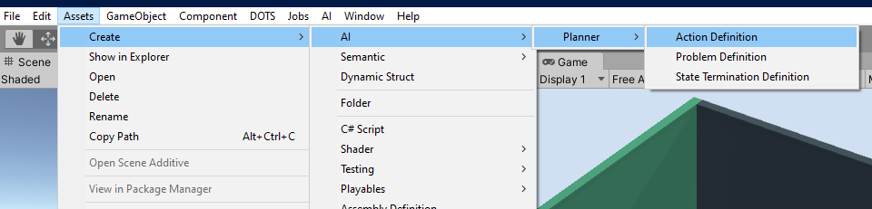
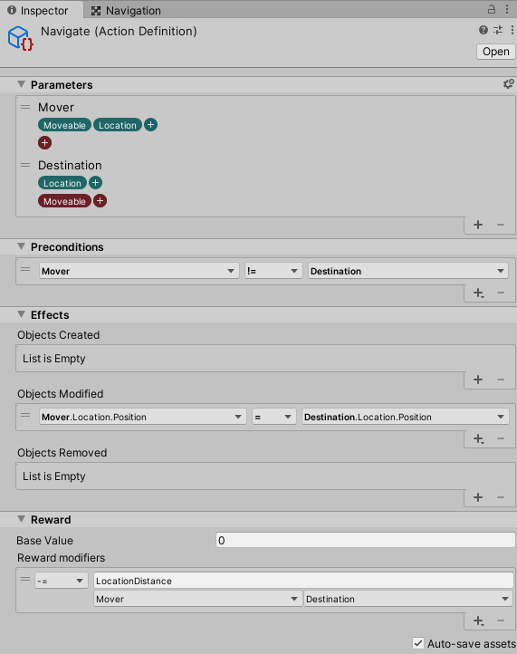
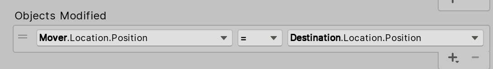
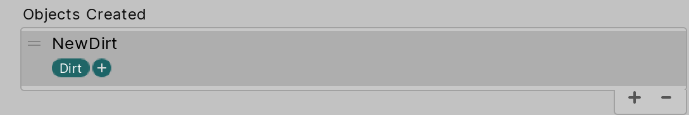
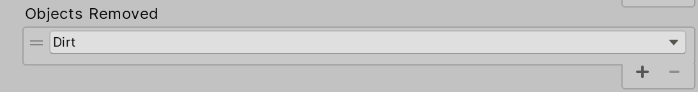

# Defining actions

A plan is composed of actions that an agent makes in pursuit of its goal. To define an action, create an "Action Definition" via the asset creation menu (Create -> AI -> Planner) or the Create menu from the project window.

## Action Definitions

An action is defined by the following:
* Name - The name of the action.
* Parameters - The set of objects involved in and potentially affected by the action.
* Preconditions - The conditions under which the action may be performed.
* Effects - The changes incurred by objects as a result of the action.
* Cost / Reward - The cost (negative) or reward (positive) for taking the action.

### Parameters

Typically, an action operates on one or more objects in the world, such as in the case of an agent navigating to another location (pictured above). In this example, the agent and the destination are all parameters of the Navigate action. For this action to be performed, valid targets for these parameters must exist and may have further requirements on their respective traits. To specify which objects are involved, start by adding a parameter for each.

Parameters are given a name, so that you can refer to them in the preconditions and effects of the action. Typically, this is a generic term for the type of object, such as "mover" or "destination". Furthermore, each parameter is constrained by the set of traits which must and/or must not be possessed by an object in order for it to be considered a valid parameter for the action. In the navigate example, the mover parameter requires "Moveable" and "Location" traits, filtering out all objects without "Moveable" from consideration.

### Preconditions

Beyond specifying the trait compositions on parameters of the action, you may specify further required conditions on the properties of the parameters' traits. These conditions may be specified on a single object (e.g. checking that a count is greather than 0) or specified between properties on multiple objects (e.g. making sure that two positions are equal). Whenever one or more of the preconditions are not met, the action is considered invalid and is excluded from the planning process. 

### Effects

The effects of an action specify _what changes_ as a result of the action, which can be changes in trait property values or the creation or deletion of objects in the world. Changes in trait properties are defined by the trait property to be changed, an operator specifying the type of change, and a value by which the property changes. 

Creating objects requires a full trait specification, including the initial trait property values (specified in Objects Modified). 

Deleted objects are specified by selecting the parameter referring to the object to be deleted.

### Cost / Reward

The reward is given by a numerical value associated with the inherent benefit or penalty associated with taking the action. Typically, positive values are referred to as _rewards_ while negative values are referred to as _costs_. Since the agent's goal is to maximize its cumulative reward over the course of the plan, it will prefer to select actions with high reward or low cost. As the agent maximizes _cumulative_ reward, it may select low reward actions in order to achieve a larger delayed payoff from future actions.