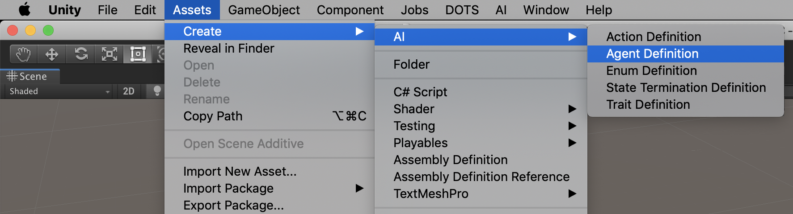
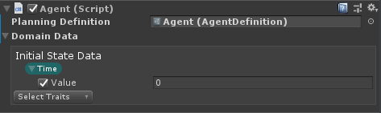

# Creating an AI Agent

## Agent Definition
An agent definition is a set of actions your character can take and a list of termination criteria. An Agent Definition asset can be created via the asset creation menu (Create -> AI -> Agent Definition) or the Create menu from the project window.



Once the asset has been created and members assigned, you can generate the code for your planning agent from the AI menu (AI -> Build Assemblies). Furthermore, if you'd like to inspect or make custom changes to the code generated by this process, you can optionally select "Build and copy files (Debug)", which will generate the various elements of the system into your project under Assets/AI.Planner/Generated. 

## Creating an Agent Class

We have provided a default BaseAgent abstract class which handles the initialization of the [PlannerSystem](xref:Unity.AI.Planner.PlannerSystem) and [Controller](xref:Unity.AI.Planner.Agent.Controller`1). The BaseAgent class inherits from MonoBehaviour and, as a default, updates the controller on each frame. 

In order to make use of the planner, you must implement your own agent class, which inherits from [BaseAgent](xref:UnityEngine.AI.Planner.Agent.BaseAgent`1). Ex:

```csharp
public class YourAgentClass : BaseAgent<YourAgentClass, DomainObject, StateEntityKey, StateData, StateDataContext, ActionScheduler, Heuristic, TerminationEvaluator, StateManager, ActionKey>
{
}
```

Note: the BaseAgent class has many template parameters, each of which has been generated as a result of building the assemblies for your agent. The one exception is the first template parameter, which refers to the type of your agent class. You'll need to fill this in yourself. 

By inheriting from the [BaseAgent](xref:UnityEngine.AI.Planner.Agent.BaseAgent`1) class, your agent class can be added as a component on the agent's corresponding GameObject.
A reference to the Agent Definition needs to be set. Furthermore, any initial state data that is _global_ (i.e. not tied to a domain object) can be specified on the component. 



Once you have an agent class, then you can define Operational Actions, which will allow you to control what happens within the game/simulation as a result of the controller selecting a planner action. See [Operational Actions](OperationActions.md) for more information.


