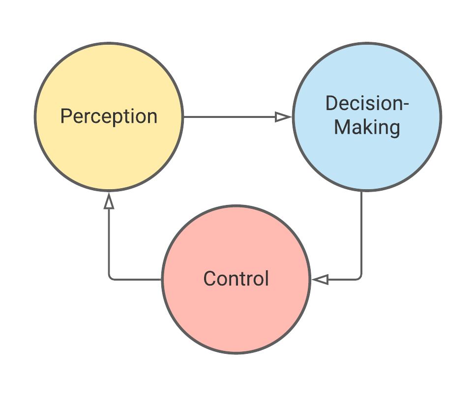
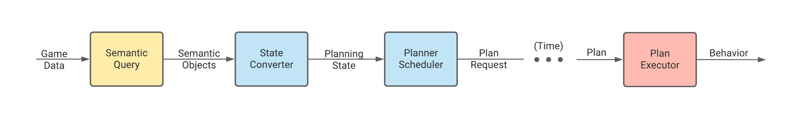

# Experimental C# API
The package features an experimental C# API for operating the underlying planning systems present in the package. This API is considered experimental as it is expected to change and may produce unexpected behavior is used in unintended manners. This document adds context to the modules, as well as provides example of their intended use. As a reference implementation demonstrating how these modules work together to create an agent capable of perception, planning, and control, see the [DecisionController](xref:Unity.AI.Planner.Controller.DecisionController). 


## High-level Overview
It is useful to begin with the behavior control loop, shown below, which governs the behavior of an agent. Here, an agent perceives information about the world (game state data), makes an informed decision about a course of action, then enacts a corresponding behavior.



Unraveling this loop, we can see the flow of information between the underlying modules. The game state data is filtered through a world query, providing a filtered subset of the semantic objects, according to the constraints of the query. This filtered view is converted into a representation used for planning, i.e. a planning state. With this snapshot of world data, a request for a plan is made. Over time, the scheduler will schedule planning jobs to iteratively build the requested plan. Once ready, the plan is assigned to the plan executor, which translates decisions---in the form of parameterized actions from the plan---into method calls.




## Semantic Query

The SemanticQuery component, found in the Traits package, provides a method of querying the game state for semantic objects. 

```csharp
// To access the SemanticObject component from the Traits package.
var worldQuery = queryGameObject.GetComponent<SemanticQuery>();

// Query for semantic objects
var semanticObjects = worldQuery.GetSemanticObjects();
```


## Accessing the Planning Modules

For each problem definition, the code generation process produces a unique class which will initialize the planning modules. The type for the provider is stored in the [ProblemDefinition](xref:Unity.AI.Planner.Traits.ProblemDefinition). Below is a snippet of code illustrating how a user might initialize and access the modules.

```csharp
// To initialize the planning systems 
var systemsProviderType = problemDefinition.SystemsProviderType;
var systemsProvider = (IPlanningSystemsProvider) Activator.CreateInstance(systemsProviderType);
systemsProvider.Initialize(problemDefinition, simulationWorldName);

// To access the systems, once they have been initialized
var stateConverter = systemsProvider.StateConverter;
var scheduler = systemsProvider.PlannerScheduler;
var planExecutor = systemsProvider.PlanExecutor;
```


## State Converter

Use the state converter ([ITraitBasedStateConverter](xref:Unity.AI.Planner.Traits.ITraitBasedStateConverter)) to convert game state to a planning state instance. The converter accepts an entity representing the planning agent as well as a set of other entities from semantic objects to be included in the planning state. Below is an example using queried objects.

```csharp
// The entity for the planning agent
var agentEntity = GetComponent<SemanticObject>().Entity;

// Access the entities of the semantic objects queried with the SemanticQuery 
var queriedEntities = semanticObjects.Select(obj => obj.Entity);

// Convert the entity data to a planning state
var state = stateConverter.CreateState(agentEntity, queriedEntities);
```


## Plan Requests and Scheduling

Requests for plans are made through the scheduler ([IPlannerScheduler](xref:Unity.AI.Planner.IPlannerScheduler)) . **Note**: currently, each scheduler can only manage a single plan request at a time. When requesting a plan, you may specify [PlannerSettings](xref:Unity.AI.Planner.PlannerSettings) as well as a callback which accepts the plan once the planning has completed.  For full details on plan requests, see [IPlanRequest](xref:Unity.AI.Planner.IPlanRequest). 

```csharp
var plannerSettings = new PlannerSettings
{
	CapPlanSize = true,
	MaxStatesInPlan = 1000,
};

// Method 1 for specifying planner settings
var planRequest = scheduler.RequestPlan(state, PlanCompleteCallback, plannerSettings);

// Method 2 for specifying planner settings
planRequest = scheduler.RequestPlan(state, PlanCompleteCallback)
					   .PlanUntil(planSize: 1000)
    				   .SchedulingMode(framesPerUpdate: 10);
```


## Plan Execution

The plan executor module ([ITraitBasedPlanExecutor](xref:Unity.AI.Planner.Traits.ITraitBasedPlanExecutor)) translates actions from the plan into parameterized method calls (MonoBehaviours only, at this time) This is accomplished through assigning the methods and parameters as [ActionExecutionInfo](xref:Unity.AI.Planner.Controller.ActionExecutionInfo), which can be specified as serialized data on components. Once the plan executor has been initialized, this data can be provided to the executor by

```csharp
MonoBehaviour actorComponent = ... // provide a MonoBehaviour, often "this"
ActionExecutionInfo[] actionExecutionInfos = ... // one for each action in the plan
var executionSettings = new PlanExecutionSettings
{
    ExecutionMode = PlanExecutionSettings.PlanExecutionMode.WaitForMinimumPlanSize,
    MinimumPlanSize = 1000,
};

planExecutor.SetExecutionSettings(actorComponent, actionExecutionInfos, executionSettings);
```


While enacting a plan, the plan executor tracks the process by being updated with the current world state. After the agent has completed an action, typically the game state changes, and the plan executor requires the up-to-date trait data to determine if it is still within the predictions of the plan. This is the behavior control loop in action. One iteration of the plan execution often is as simple as 

```csharp
// Specify the plan to be enacted
planExecutor.SetPlan(planRequest.Plan);

// Update the executor's tracked state
planExecutor.UpdateCurrentState(state);

// The plan execution settings determine when the executor is determined ready
if (planExecutor.ReadyToAct())
	planExecutor.ExecuteNextAction();
```

