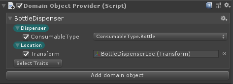

# Configuring the Scene

## Domain Object Provider

Every plan begins with an initial or _root_ state, describing the circumstances under which an agent plans its future course of action. To initialize this root state, domain object providers allow you to set up domain objects (i.e. objects represented in the planning reprentation) on the different GameObjects that compose a scene.

To add a provider add a DomainObjectProvider component on a GameObject.

A domain object provider can hold one or multiple domain objects. 
Each domain object is defined by the following:
* Name - The name of the object
* Traits - A list of selected traits that are possessed by the object
* Traits properties - Optional initial value for a property (or use default value)
