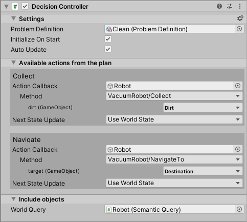

# Configuring the scene

Once you've defined your domain, you can configure your scene by adding traits via `TraitComponent` to individual GameObjects and setting up your AI agent with a `DecisionController`.

## Trait Component

Every plan begins with an initial or _root_ state, describing the circumstances under which an agent plans its future course of action. To initialize this root state, GameObjects that you may want to include in your planning state need to be marked appropriately with traits.

You can add a `TraitComponent` to a GameObject to specify traits for that object.

A `TraitComponent` has a:
* Name - The name of the object (defaults to GameObject name)
* Traits - A list of selected traits that are possessed by the object
* Trait properties - Optional initial values for properties (otherwise default values are used)

## Decision Controller

After setting up GameObjects in the scene with traits you can add a `DecisionController` to your AI agent GameObject.

A `DecisionController` has:
* An assignment of the `PlanDefinition`
* Callback assignments for different actions
* A world query for including trait-based objects in the initial root state
* Local trait-based objects specific to this planner

Advanced options for controlling the planner search and execution are also available by clicking the cog icon on the DecisionController (shown below). For tips on improving planner performance, see [Improving Performance](PlannerPerformanceTips.md).

