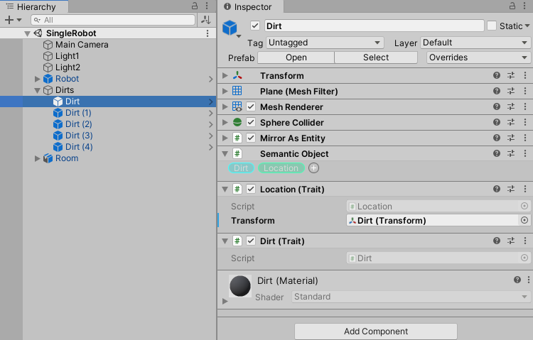
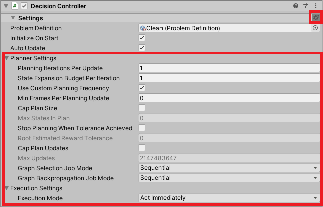
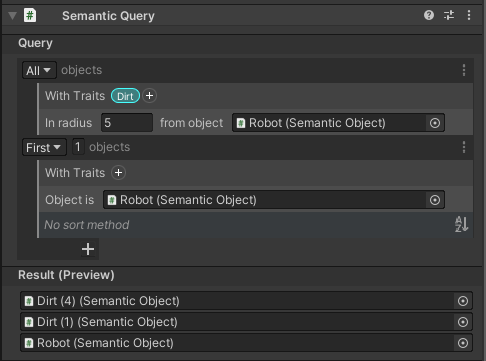

# Configuring the scene

Once you've defined your domain, you can configure your scene by adding traits via the `Semantic Object` component (from the Traits package) to individual GameObjects, then setting up your AI agent with a `Decision Controller`.

## Adding Traits to Your Scene

The AI Planner creates plans using trait data associated with GameObjects. Once you have defined the traits that represent the semantics of your scene, add the `Semantic Object` component to a GameObject to specify traits for that object. Once a trait has been added to an object, you can assign new values to the trait properties, reflecting the particular data associated with the object.

## Decision Controller

After setting up GameObjects in the scene with traits you can add a `Decision Controller` to your AI agent GameObject.

In order to make and execute plans, a `Decision Controller` requires a [ProblemDefinition](ProblemDefinition.md), which defines the planning problem to be solved. Once assigned, the `Decision Controller` will display:
* The assigned `Problem Definition`
* Settings for initialization and automatic updating (see [DecisionController](xref:Unity.AI.Planner.Controller.DecisionController))
* Callback assignments for enacting the actions included in the `Problem Definition`
* A world query field, in which you may assign a reference to an object with a `Semantic Query` component (Traits package), which will define which semantic objects are included in the planning state

Advanced options for controlling the planner search and execution are also available by clicking the cog icon on the `Decision Controller` (shown below). For tips on improving planner performance, see [Improving Performance](PlannerPerformanceTips.md).

### Action Callbacks

Actions authored as `Action Definitions` represent models of the actions an agent may perform, as used by the planning process to simulate possible futures. Such definitions specify at a high level the constraints of using the action (preconditions) as well as the expected outcomes (effects). As such, they omit many of the practical considerations of performing an action in a game. For example, an action requiring an agent to move to another location may need to set a destination on a NavMeshAgent and begin following a given path. Similarly, you may wish to trigger various animations that visually exhibit an action being performed. 

In order for an object with a `Decision Controller` to interact with your scene through enacting its plan(s), you must provide action callbacks for each action contained in the controller's plan definition. At each instance when the controller decides to act, the corresponding action callback will be invoked. Notably, this only occurs at the beginning of each action. It will be left to the user to set up the appropriate code to perform the action in the scene, e.g. triggering animations, changing trait data on objects, etc. Furthermore, consider that while an `Action Definition` specifies what is *expected* to occur, in many applications, the true outcomes may be substantially different, particularly if the action is blocked, delayed, or otherwise interacted with by a player or by another game system. **The effects from actions defined in `ActionDefinitions` are not automatically applied to the scene. It is up to the user to ensure these effects occur.** 

Action callbacks can take either of two forms:

- Coroutine - The controller will initiate the coroutine and wait until its completion before updating its current state and proceeding with plan execution. This is the recommended choice for actions that execute over multiple frames.
- Non-coroutine - The controller will invoke the callback, then immediately update its current state and proceed with plan execution. 

Furthermore, you can specify arguments for the callbacks to access data from the action's parameters. For example, in the image below, we have set up the callback for the action Navigate. First, the object holding the appropriate script is assigned. Then, you can select which method to invoke from the available methods on the game object. If the method has any GameObject or trait parameters, you must assign the appropriate fields from the parameters of the corresponding `Action Definition`. Here, the `NavigateTo` method accepts a target GameObject to navigate toward; for this object, we specify the `Destination` parameter from the action definition. **Note: Trait arguments are value types and should be treated as *readonly* data. If you desire to modify trait data on an object, you must assign the modified trait data on the relevant object.** 

As plans contain predictions of various futures that may not occur as predicted, the controller  tracks the progress of the execution of its current plan. After every action, the `Decision Controller` updates its current state, which designates where in the plan it is currently.  You can specify how this update should occur, either:

- Use World State - Queries the world for current objects and trait data. This is the recommended setting, particularly if your application involves potential changes or interactions not predicted by the modeled action effects. 
- Use Next Plan State - Uses the predicted state from the plan, which disregards any unexpected changes to the live scene data. While it is the more performant option, this setting is only recommended if the modeled action's predictions are accurate or if inaccuracies should be ignored. 

### Querying the World

For most applications, agents will query the world for state changes. This process pulls in data from all of the `GameObjects` with a `Semantic Object` component, forming a snapshot of the current state of the world. By default, all objects will be included in the query. However, this is not always desirable, as the number of objects can be very large, which can severely reduce performance. A better practice is to limit which objects are included in the world query to just those the agent will  potentially use in its plans. 

Pictured above is an example of a world query composed of clauses specifying which objects should be included. **Note: the interpreted order is a disjunction (OR) over conjunctions (AND).** In this example, the interpretation is (`in radius: 5` AND `With Traits: Dirt` ) OR (`From GameObject: Robot`), meaning the query will pick up dirt objects within 5 meters and the Robot semantic object.
