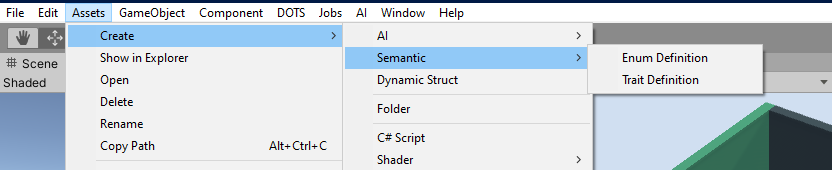
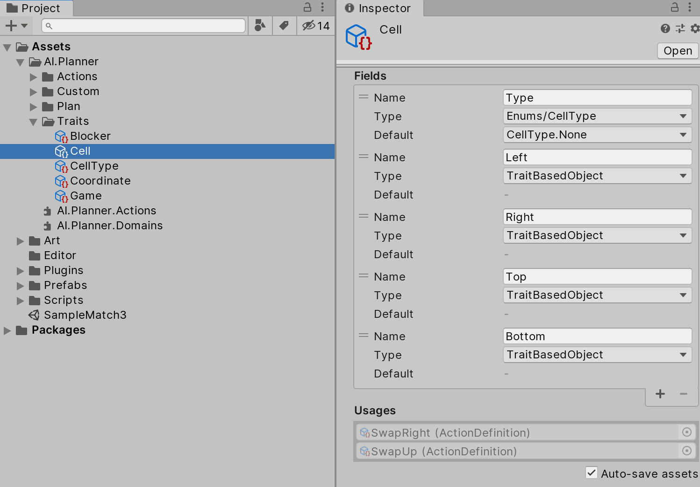

# Defining the domain

For the Planner to be able to solve a problem, a model that represents this problem need to be created first. This model is expressed using a trait-based domain language that can represent a large variety of scenarios.

To define a planning domain, two types of assets can be used: "Trait Definition" and "Enum Definition". These assets can be created via the asset creation menu (Create -> AI -> Trait -> Trait or Enum Definition) or the Create menu from the project window.

You can edit domain assets in the Unity inspector.

## Enumerations

The trait-based domain language supports most basic data types, such as int, float, bool, and enum. For the latter, "Enum Definition" assets allow you to define custom enumerations to be used by properties in your domain's traits.

## Traits

Traits are the fundamental data that represent your game/simulation. Each trait specifies a quality which objects can possess, such as the ability to be carried or to be used as a weapon. Each trait is composed of properties which reflect attributes specific to each trait. For example, consider creating a trait "Cell" which marks objects in a Match3 game that are cells. Such a trait may possess a property "Type" (utilizing a CellType enumeration), which denotes the color of the cell. In this way, traits are defined by:
* A name
* A list of named properties with types and default values

