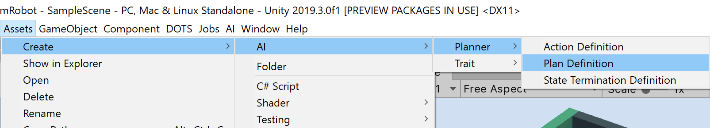
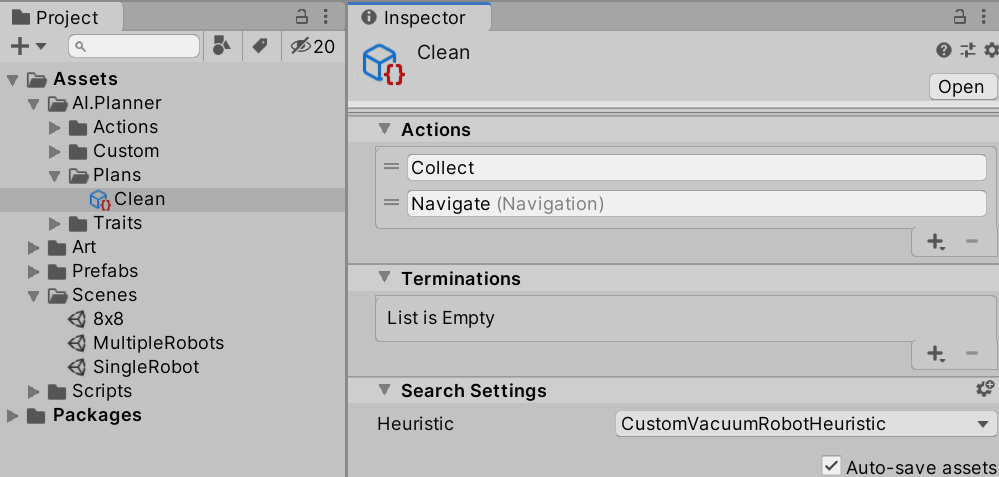
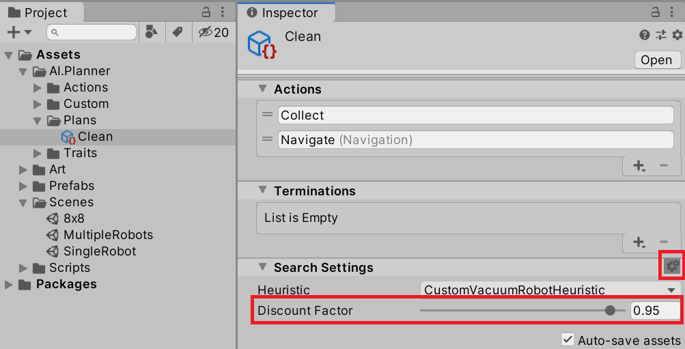

# Creating a plan definition

A plan definition is where your [domain definition](DomainDefinition.md) (i.e. traits and enumerations) is associated with your [actions](ActionDefinition.md) and [state terminations](TerminationDefinition.md), together providing the information necessary for the search algorithm to create plans. When assigned to a`DecisionController` component when you [set up your scene](ConfigureScene.md), a `PlanDefinition` defines the types of plans your agent will create and execute. 

## Plan Definition
A plan definition holds the set of actions and a list of termination criteria that are used by the planner to generate a plan. Create a "Plan Definition" asset via the asset creation menu (Create -> AI -> Planner -> Plan Definition) or the Create menu from the project window.

Once the asset has been created you can assign or create new actions, assign or create new state termination criteria, and specify a heuristic[^#1] to be used by the search algorithm. When you create actions, any built-in actions will show up under their own submenu (e.g. Navigation).

[^#1]: For more information, see [Custom Heuristics](CustomPlannerExtensions.md).

Additionally, as an advanced user setting, you may specify a plan discount factor through the cog icon under Search Settings (see below). This parameter controls the weighting of future action rewards when determining the cumulative reward for a plan. A value of 1 means the future action rewards will not be discounted. Otherwise, each plan action's reward is discounted by **dt** where **d** is the discount factor and **t** is how many steps/actions precede the action being evaluated. 

