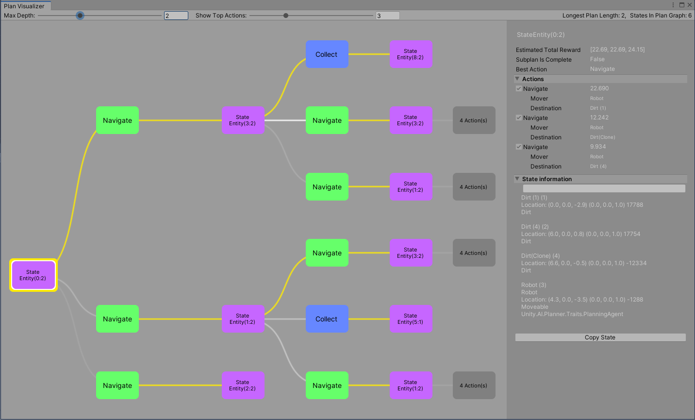

# Plan Visualizer

With the Plan Visualizer, you can debug and monitor the plan expansion for an individual agent by the planner system. You can open the Plan Visualizer through the Window menu (Window -> AI -> Plan Visualizer)

## Window

The window shows the plan in the form of a tree (although, internally it is a graph). Here you can see the current state or action as well as the resulting states from each possible action taken.

The highlighted path above shows the best action from the current state. The nodes on the far right show that there are successor nodes not shown. You can click on any one of these to navigate further into the plan.

### Inspector

The plan visualizer has a simple inspector to view the state data for a node. Click on any node and use the scroll window to look through individual trait-based objects. You can also copy the state data to the clipboard, which can be useful in conjunction with a diff program to see what has changed between two states.

By default, the plan visualizer limits the number of branches shown for each state, which can be set using the slider at the top of the window. This set of actions represents the best *N* actions, according to predicted cumulative reward from each action through the end of the plan. On occasion, it is useful to explore lower ranking actions. You can include such actions by selecting them in the **Successor Actions** foldout. 

Below is a view of a plan limited to the top 2 actions, but for the middle state, two additional actions have been selected, as you can see in the side panel. 

