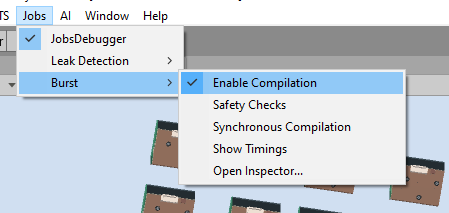

# Tips for Improving Performance
## Jobs Settings
The planning jobs are Burst-compatible, which can improve planning performance significantly. Be 
sure to disable leak detection and enable Burst in the Jobs menu. Note: This can significantly 
lengthen start-up time due to extra compilation, especially if *Synchronous Compilation* is enabled. 

## Limiting Agent Perception
Limit the number of objects the agent perceives/reasons about. The most straightforward way to do this is through the "World query" on the decision controller. If you've set "Next State Update" to "Use World State" on your actions in the DecisionController, the agent will query the scene's game objects to update its world state. You can build this query in the last section of the DecisionController.

## Planning and Execution Settings
Use advanced settings in order to manually control when and how much search occurs. You can access these settings via the cog on the DecisionController component, as shown below. Each of the settings has a tooltip. 

A few common tips:
* If planning occurs too often, reduce the frequency. 
* If your plans are larger than needed, try capping the plan size. 
* If your plans are necessarily large, try out the parallel selection and backpropagation job modes, which operate more efficiently on large plans but less efficiently on small plans.

## Designing a Custom Heuristic
The amount of search required to find a successful plan can be directly related to the quality of the heuristic used. Custom heuristics allow users to incorporate domain-knowledge about their game and planning problem to improve search. 

Given a state to evaluate, a custom heuristic can be used to provide three values (making up a [BoundedValue](xref:Unity.AI.Planner.BoundedValue)) used in the graph search:

* An average/estimate of the cumulative reward/cost to be received from the state onward. The current plan includes the exact rewards leading up to this state. The heuristic provides an estimate how much reward will be accumulated beyond this state. Together, we have an estimate of the total reward (exact rewards leading to the state + estimated reward after the state). When the agent acts, it will choose the next immediate action that maximizes the estimated cumulative reward of the entire plan.
* An upper bound (optimistic estimate) on the cumulative rewards to be received from the given state onward. If you've worked with A\*, say for pathfinding, you'll know that A\* requires an admissible or optimistic heuristic estimate to find the optimal path (typically Euclidean distance in pathfinding). This is key for the search to explore branches of the state space which might improve the current plan.
* Finally, a lower bound (pessimistic estimate) for the future cumulative rewards. This value is used to prune branches of the (incomplete) plan during the iterative search process, such that we don't waste iterations in areas of the state space with lower reward. Example: consider a scenario where we can take either of two actions leading to states A and B, with bounded value estimates [lower=5, est=7, upper=10] and [lower=0, est=2, upper=3], respectively. Since we know that the worst case of the first action (lower bound = 5) is greater than the best case of the second action (upper bound = 3), we prune from consideration the second action.

Tips:
* If the planner is being used to compute a plan toward a fixed goal, try to have the heuristic converge to narrower bounds the closer to the goal the state is. This can help the search process immensely.
* Be aware of the trade-offs of choosing bounds estimates that are too conservative (i.e. high upper bounds and low lower bounds). If your optimistic estimate is too high, the search can spend many iterations exploring branches that might be good but, in truth, are not. Similarly, if your lower bound estimates are too low, no pruning occurs, which can result in a shallow search with short, incomplete plans.
* Conversely, try not give bounds estimates that are narrower/tighter than true cumulative future rewards. If your upper bound estimate is too low, the search can miss branches that lead to the true "optimal" plan. If your lower bound estimate is too high, the search might prune branches it shouldn't.