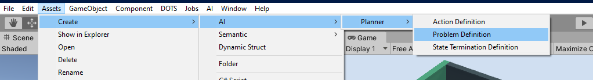
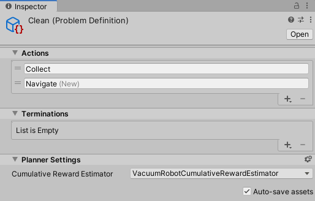
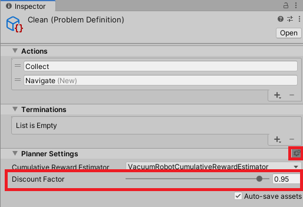

# Creating a problem definition

A problem definition is where your [domain definition](DomainDefinition.md) (i.e. traits and enumerations) is associated with your [actions](ActionDefinition.md) and [state terminations](TerminationDefinition.md), together providing the information necessary for the planning algorithm to create plans. When assigned to a `DecisionController` component when you [set up your scene](ConfigureScene.md), a `ProblemDefinition` defines the types of plans your agent will create and execute. 

## Problem Definition
A problem definition holds the set of actions and a list of termination criteria that are used by the planner to generate a plan. Create a "Problem Definition" asset via the asset creation menu (Create -> AI -> Planner -> Problem Definition) or the Create menu from the project window.

Once the asset has been created you can assign or create new actions, assign or create new state termination criteria, and specify a cumulative reward estimator[^#1] to be used by the planning algorithm. When you create actions, any built-in actions will show up under their own submenu (e.g. Navigation).

[^#1]: For more information, see [Custom Cumulative Reward Estimators](CustomPlannerExtensions.md).

Additionally, as an advanced user setting, you may specify a plan discount factor through the cog icon under Planner Settings (see below). This parameter controls the weighting of future action rewards when determining the cumulative reward for a plan. A value of 1 means the future action rewards will not be discounted. Otherwise, each plan action's reward is discounted by **dt** where **d** is the discount factor and **t** is how many steps/actions precede the action being evaluated. 

## Generating Code

Once your traits, actions, termination criteria, and problem definition(s) have been defined, the next step is to generate code to be used at runtime within the planning jobs. To generate these files, use the build command in the AI menu (AI -> Planner -> Build).