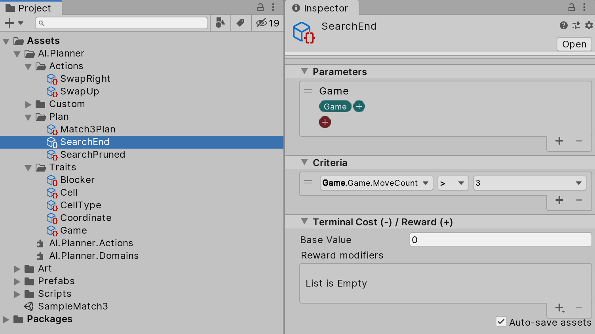

# Defining termination conditions

For most applications, there is no need to continue planning beyond a point in which one or more termination conditions have been met. These conditions may represent the achievement of a desired goal or possibly the circumstances in which success has become impossible, such as when an agent has been defeated.

## Termination Criteria

Each termination criterion is defined by a set of traits required to be on an object as well as conditional checks on the values of one or more properties of those traits. For example, a termination criterion may be defined on objects with the "Health" trait when the "HitPoints" property reaches 0. In the example below for a Match3 game, we terminate the search when there are already more than 3 moves planned.

## Terminal Cost / Reward

Similar to [action definitions](ActionDefinition.md), a state termination can define a cost or reward for reaching a terminal state. The reward is given by a numerical value associated with the inherent benefit or penalty associated with reaching this state. Typically, positive values are referred to as _rewards_ while negative values are referred to as _costs_. The planner maximizes the cumulative reward over the course of the plan, so a terminal state with a high reward or low cost may be factored into the optimal plan.