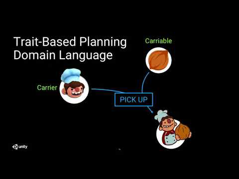
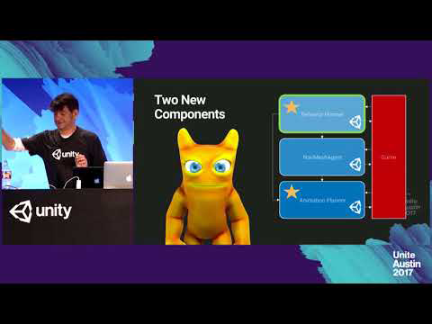

# About AI Planner

The AI Planner package can generate optimal plans for use in agent AI, storyline generation/management, game/simulation validation, tutorial creation, automated testing, and many more. A generic planner framework, authoring tools, and a plan visualizer are provided in the package.

# Installing AI Planner

To install this package, follow the instructions in the [Package Manager documentation](https://docs.unity3d.com/Packages/com.unity.package-manager-ui@latest/index.html). 

In Unity 2020.1 and later versions, preview packages will no longer be listed in the package manager. To include the package in your project, you will need to [edit the project manifest](https://docs.unity3d.com/2020.1/Documentation/Manual/upm-concepts.html#Manifests), adding this package (com.unity.ai.planner) as a dependency.

# Using AI Planner
To create an AI agent using the AI Planner, see the following guides:
* [Defining the domain](DomainDefinition.md)
* [Defining actions](ActionDefinition.md)
* [Defining termination conditions](TerminationDefinition.md)
* [Creating a problem definition](ProblemDefinition.md)
* [Configuring the scene](ConfigureScene.md)

For debugging and advanced usage of the AI Planner, see 
* [Visualizing a plan](PlanVisualizer.md)
* [Extending the planner](CustomPlannerExtensions.md)
* [Improving performance](PlannerPerformanceTips.md)
* [Experimental API](CodeAPI.md)

For sample projects, see: [AI Planner Samples](https://github.com/Unity-Technologies/ai-planner-samples) 

## Talks
### Unite LA 2018 - _AI for Behavior: Advanced Research for Intelligent Decision Making_

### Unite Austin 2017 - _Unity Labs Behavioral AI Research_

# Technical details
## Requirements

This version of AI Planner is compatible with the following versions of the Unity Editor:
* 2020.1

## Package contents

The following table indicates the runtime folders that will be of interest to you as a developer:

|Location|Description|
|---|---|
|`Runtime/Controller`|Contains classes and interfaces for generating and executing plans.|
|`Runtime/Modules`|Contains traits, actions, custom modifiers, and sample callback scripts for built-in functionality.|
|`Runtime/Planner`|Contains the planning system.|
|`Runtime/Serialization`|Contains serialized data definitions.|
|`Runtime/Traits`|Contains state and action data structures and interfaces used by the planner.|
|`Runtime/Utility`|Contains utility classes for the package.|

## Document revision history

|Date|Reason|
|---|---|
|Nov 02, 2020|Document updated. Matches preview package version 0.2.4.|
|Dec 02, 2019|Document updated. Matches preview package version 0.2.0.|
|Aug 28, 2019|Document updated. Matches preview package version 0.1.0.|
|Mar 18, 2019|Document created. Matches preview package version 0.0.1.|